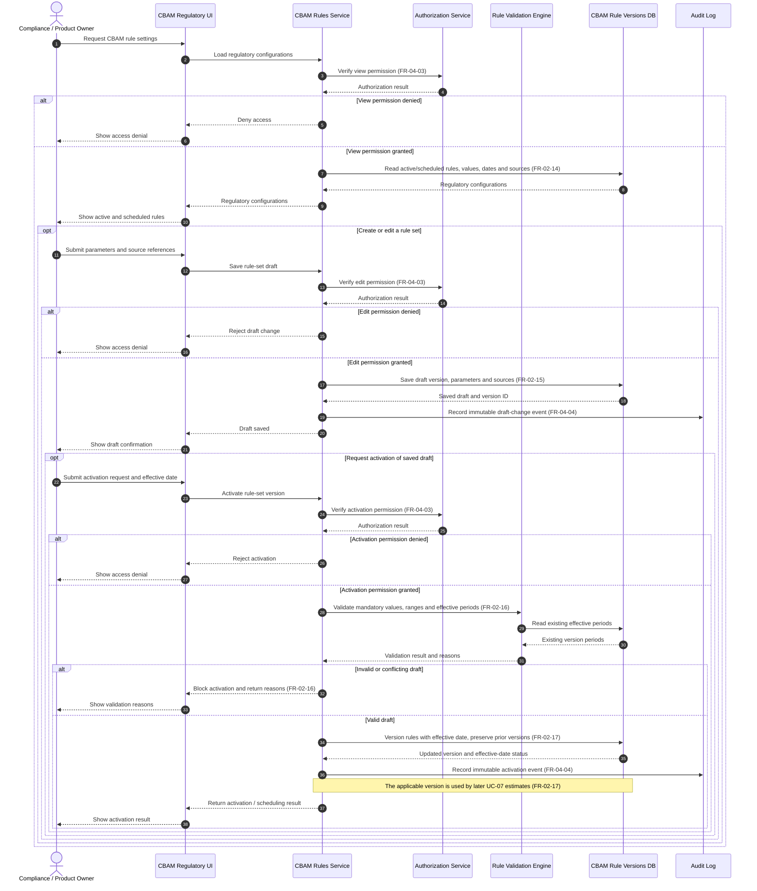

# SD-UC-08 — Manage CBAM Regulatory Rules & Parameters

```mermaid
sequenceDiagram
    autonumber
    actor PO as Compliance / Product Owner
    participant UI as CBAM Regulatory UI
    participant SVC as CBAM Rules Service
    participant AUTH as Authorization Service
    participant VAL as Rule Validation Engine
    participant DB as CBAM Rule Versions DB
    participant LOG as Audit Log

    PO->>UI: Request CBAM rule settings
    UI->>SVC: Load regulatory configurations
    SVC->>AUTH: Verify view permission (FR-04-03)
    AUTH-->>SVC: Authorization result

    alt View permission denied
        SVC-->>UI: Deny access
        UI-->>PO: Show access denial
    else View permission granted
        SVC->>DB: Read active/scheduled rules, values, dates and sources (FR-02-14)
        DB-->>SVC: Regulatory configurations
        SVC-->>UI: Regulatory configurations
        UI-->>PO: Show active and scheduled rules

        opt Create or edit a rule set
            PO->>UI: Submit parameters and source references
            UI->>SVC: Save rule-set draft
            SVC->>AUTH: Verify edit permission (FR-04-03)
            AUTH-->>SVC: Authorization result

            alt Edit permission denied
                SVC-->>UI: Reject draft change
                UI-->>PO: Show access denial
            else Edit permission granted
                SVC->>DB: Save draft version, parameters and sources (FR-02-15)
                DB-->>SVC: Saved draft and version ID
                SVC->>LOG: Record immutable draft-change event (FR-04-04)
                SVC-->>UI: Draft saved
                UI-->>PO: Show draft confirmation

                opt Request activation of saved draft
                    PO->>UI: Submit activation request and effective date
                    UI->>SVC: Activate rule-set version
                    SVC->>AUTH: Verify activation permission (FR-04-03)
                    AUTH-->>SVC: Authorization result

                    alt Activation permission denied
                        SVC-->>UI: Reject activation
                        UI-->>PO: Show access denial
                    else Activation permission granted
                        SVC->>VAL: Validate mandatory values, ranges and effective periods (FR-02-16)
                        VAL->>DB: Read existing effective periods
                        DB-->>VAL: Existing version periods
                        VAL-->>SVC: Validation result and reasons

                        alt Invalid or conflicting draft
                            SVC-->>UI: Block activation and return reasons (FR-02-16)
                            UI-->>PO: Show validation reasons
                        else Valid draft
                            SVC->>DB: Version rules with effective date, preserve prior versions (FR-02-17)
                            DB-->>SVC: Updated version and effective-date status
                            SVC->>LOG: Record immutable activation event (FR-04-04)
                            Note over SVC,DB: The applicable version is used by later UC-07 estimates (FR-02-17)
                            SVC-->>UI: Return activation / scheduling result
                            UI-->>PO: Show activation result
                        end
                    end
                end
            end
        end
    end
```
